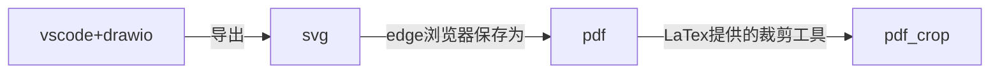

[toc]

记录一些效率小工具

## PDF Tool

针对pdf的工具，如拆分、提取页面等。[在线拆分PDF文件。免费拆分PDF文件](https://www.ilovepdf.com/zh-cn/split_pdf)。

本地通过`pypdf`库实现提取页面、将pdf文件拆分为奇数和偶数页（<u>方便使用U盘双面打印</u>）。

安装：`pip install pypdf`，`python3.8`及以上。

python文件：[pdf_tool.py](./pdf_tool.py)

拆分为奇数和偶数页：`split_pdf_odd_even`

```shell
python pdf_tool.py --operation_type split --input_pdf_path E:\\shu\\xxx.pdf --start_page 2 --end_page 8
```

* operation_type: split表示拆分为奇数和偶数2个pdf，start_page和end_page表示拆分的起止页，不是从0开始。
* 默认保存为xxx_even.pdf, xxx_odd.pdf，目录同源文件。

提取指定页：`extract_pdf_pages`

```shell
python pdf_tool.py --operation_type extract --input_pdf_path E:\\shu\\xxx.pdf --extract_pages_number 1,3,9
```

* operation_type: extract表示提取指定页数
* 默认保存为xxx_1.pdf, xxx_3.pdf，目录同源文件。


## 自动登录校园网

python文件：[auto_login_shu.py](./auto_login_shu.py).

使用说明：[auto_login_shu.md](./auto_login_shu.md).

## drawio科研画图自动化

原本使用vscode + drawio插件的画图流程如下：

1. 在vscode中画图，并导出为svg格式；
2. 使用edge浏览器打开svg文件并保存为pdf；
3. 使用latex提供的pdfcrop工具裁剪pdf多余空白；



当文件较多时，上面流程比较繁琐，于是通过python将上述流程自动化。

使用文档见[drawio-automation/README](drawio-automation/README.md).

但是突然发现，drawio桌面版支持直接导出为pdf，因此上面的流程有点繁琐，将在下一版精简，直接通过drawio CLI完成导出为pdf并裁剪。