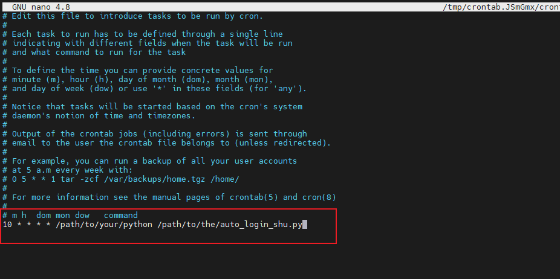

[toc]

# 自动登录校园网

自动登录脚本见文件`auto_login_shu.py`. 需提供自己的校园网信息，填充`login_config`即可：

```python
if __name__ == '__main__':
    # 填充你自己的参数
    login_config = {
        "user_id": "22721284",
        "user_index": "xxx",
        "password": "xxx",
        "cookie": "xxx",
        "query_string": "xxx",
    }

    alu = AutoLoginUtil(login_config)
    if alu.is_network_accessible() is True:
        logger.info("当前网络已接入！")
        sys.exit(0)

    # 关闭代理. （联网后自己手动开启vpn）
    if ProxyUtil.is_proxy_enabled() is True:
        ProxyUtil.set_proxy(enable=False)

    max_try, time_interval = 10, 5
    for i in range(max_try):
        if alu.login() is True:
            logger.info("登录成功！")
            break
        logger.error("第{}次尝试登录失败，{}s后重试...".format(i + 1, time_interval))
        time.sleep(5)
```

## 如何获取登录信息

**query_string的获取**：打开浏览器，输入`10.10.9.9/…`尝试进入校园网**登录界面**，复制`?`后面的内容，如下：


**其它参数的获取**

点击`F12`进入开发者模式，点击网络菜单，然后登录，如下：


点击网络面板中名为`success.jsp`的网络请求，从**请求标头**中可以获取`Cookie`以及`password`，`password`的密文就在`Cookie`中，名为`EPORTAL_COOKIE_PASSWORD`。在**常规**中的请求URL中复制`userIndex`，界面如下：


获取上面的登录信息后，将`auto_login_shu.py`中的`login_config`进行填充即可。

## 如何定期执行该脚本

该脚本仅使用python内置库，无需安装任何第三方库，且对python版本基本没要求。

### Windows解决方案 - schtasks

`schtasks`详细用法直接问gpt，可参考如下配置：

```shell
# 新建周期任务。每隔20min执行一次，建议不要过于频繁。
schtasks /create /tn "auto_login_shu" /tr "\"D:\software\anaconda3\envs\ibrnet\python.exe\" \"D:\CDJ\code\toolkits\auto_login_shu.py\"" /sc minute /mo 20
# 查询任务
schtasks /query /tn "auto_login_shu"
# 删除任务
schtasks /delete /tn "auto_login_shu"
```


### Linux解决方案 - crontab 定时任务

Note：未测试

使用`crontab -e`编辑定时任务表，并添加定时任务：



上面的cron表达式`10 * * * *`表示10min整的时候执行后面的命令，用**绝对路径**。

不了解crontab的直接gpt。

## 如果开了代理

如果开了代理，需填写你的代理地址（一般是一样的）。如果开了代理但又没给代理地址，则不管有网没网都会执行登录操作：


登录逻辑：有网络则直接退出，没网才进行登录。

```python
alu = AutoLoginUtil(login_config)
if alu.is_network_accessible() is True:
    logger.info("当前网络已接入！")
    sys.exit(0)
# 没网则执行登录操作
...
```


