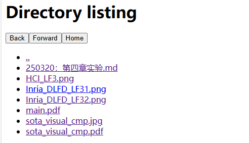
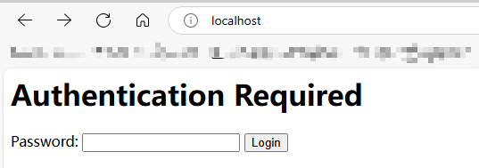

# Python 文件服务器

这是一个基于 Python 的简单文件服务器，支持目录浏览、文件下载、Markdown 文件渲染以及密码保护功能。通过使用多线程技术，服务器能够处理并发请求，适合在局域网或本地环境中快速浏览/共享文件。

## 功能特性

- **目录浏览**：自动生成目录列表，支持返回上级目录、前进、后退和返回主页功能。
- **文件下载**：支持下载任意文件类型，包括文本文件、图片、PDF 等。
- **Markdown 渲染**：自动将 `.md` 文件渲染为 HTML 页面，方便查看。
- **密码保护**：支持通过密码保护访问，确保文件安全。
- **多线程支持**：通过 `ThreadingMixIn` 实现多线程处理，支持并发访问。

## 使用方式

### 1. 安装依赖

确保你的系统已安装 Python 3.x，并安装以下依赖库：

```bash
pip install markdown
```

### 2. 启动服务器

将代码保存为 `file_server.py`，然后通过命令行启动服务器：

```bash
python file_server.py -d /path/to/your/directory -p 80 -pw your_password
```

#### 参数说明

- `-d` 或 `--dir`：指定要共享的目录路径（必填）。
- `-p` 或 `--port`：指定服务器监听的端口号（默认：80）。
- `-pw` 或 `--password`：设置访问密码（可选，不设置则无需密码）。

#### 示例

```bash
python file_server.py -d /home/user/files -p 80 -pw mypassword
```

### 3. 访问服务器

在浏览器中访问服务器的 IP 地址和端口号（如果端口号是80，则可以不显式输入端口`:80`，http服务默认是80端口），例如：

```sh
http://192.168.1.100:80 or http://192.168.1.100
```

如果设置了密码，首次访问时会提示输入密码。

---

## 代码结构

- **`FileServerHandler` 类**：处理 HTTP 请求，包括文件下载、目录浏览、Markdown 渲染和密码验证。
- **`run_server` 函数**：启动服务器并监听指定端口。
- **多线程支持**：通过 `ThreadingMixIn` 实现多线程处理，支持并发访问。

---

## 注意事项

1. **性能限制**：该服务器基于 Python 的 `http.server` 模块，适合小型文件共享场景。如果需要高性能或大规模并发访问，建议使用专业的文件服务器（如 `nginx` 或 `Apache`）。

2. **安全性**：密码以明文形式传输和存储，仅适用于非敏感场景。如果需要更高的安全性，建议使用 HTTPS 或其他加密方式。

3. **文件编码**：服务器默认使用 UTF-8 编码处理文件内容，确保文件名和文本文件内容正确显示。

4. **并发访问**：通过多线程支持，服务器可以处理多个并发请求，但性能仍受限于 Python 的 GIL（全局解释器锁）。

---

## 示例截图

### 目录浏览


### Markdown 渲染


### 密码验证

注意，认证基于cookie，密码是明文，在浏览器中可以看到真实密码。



